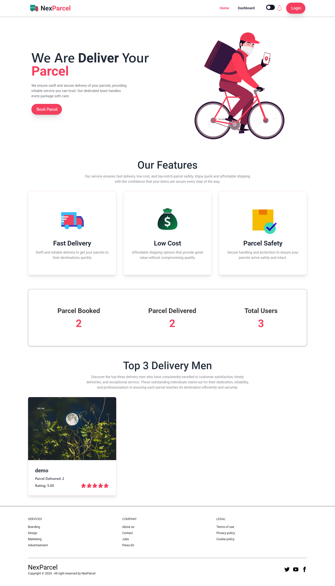
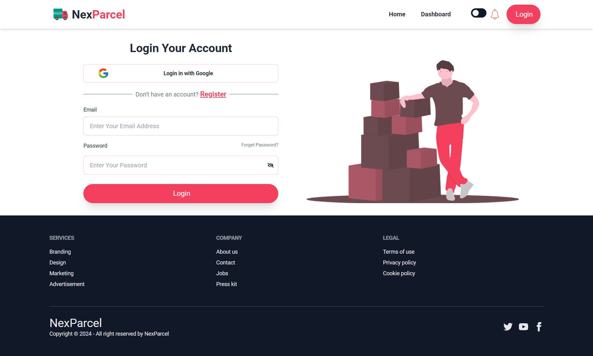
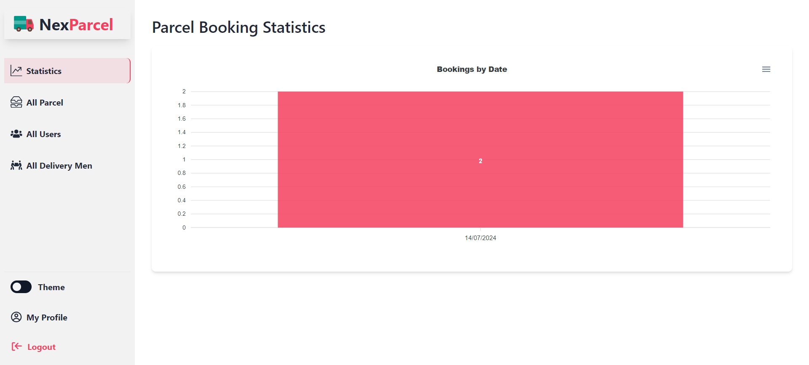

# nexParcel📦📱

This is An online platform for booking, managing, and delivering parcels, built using the MERN stack.

## Website features ✨

- **Responsive Design**: Clean, user-friendly interface optimized for mobile, tablet, and desktop devices.
- **Secure Authentication**: Robust login and registration system with JWT-based security and social login support.

- **Personalized Dashboards**: Tailored dashboards for users, deliverymen, and admin, providing specific functionalities and secure access.

- **Easy Parcel Booking**: Users can effortlessly book parcels with a detailed form, manage their bookings, and track delivery statuses.

- **Real-Time Analytics**: Admin can see real-time data visualization with interactive charts to monitor bookings by date.

- **Delivery Tracking**: Delivery personnel have a dedicated dashboard to manage and track assigned deliveries using Map.

- **User Feedback**: Users can rate and review to deliverymen, with ratings and feedback prominently displayed.

- **Secure Payments**: Integrated Stripe for secure online payments, with a smooth checkout process and a celebratory payment success page.

## Technology Used 📦

#### Front-End

- React.js
- React-Router-DOM
- TailwindCSS
- daisyUI
- HeadlessUI
- React Hook Form
- Axios
- Tanstack Query
- Lottie React
- react-hot-toast
- sweetalert2
- aos react
- react countup
- react-phone-number-input
- apexcharts
- stripe-js/react

#### Back-End

- Node.js
- Express.js
- MongoDB
- Firebase

## Screenshots📸

<i>
Fig: Home
</i>

<i>
Fig: Login
</i>

<i>
Fig: User Dashboard
</i>

<i>
Fig: User Book Parcel
</i>

<i>
Fig: All Delivery Men
</i>

<i>
Fig: All Parcels List
</i>

<i>
Fig: Admin Dashboard Stats
</i>
